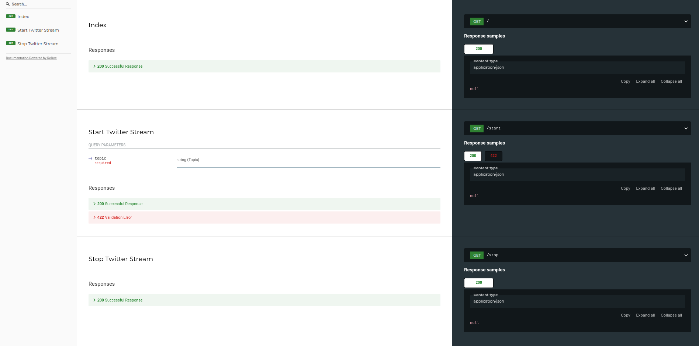

# API for TwitterHandler Package

## Documentation


Its used to access the <a href="https://github.com/HassanRady/TwitterHandler">TwitterHandler Package</a> which is used to stream filtered tweets from the twitter api v2 ingested by kafka.

Start twitter Stream endpoint success output:
```json
{
  "status": "started"
}
```
Stop Twitter Stream endpoint success output:
```json
{
  "status": "stopped"
}
```

## Run
Two ways to run the api:

bash run.sh:
```sh
    $ python -m venv .venv
    $ source .venv/bin/activate
    $ pip install -r requirements.txt
    $ uvicorn app:app --host 127.0.0.1 --port 9001 --reload
```
Or

docker container:
```docker
    $ docker build . -t twitter-handler-api
    $ docker run -p 9003:9003 -d --name twitter-handler-api twitter-handler-api
``` 